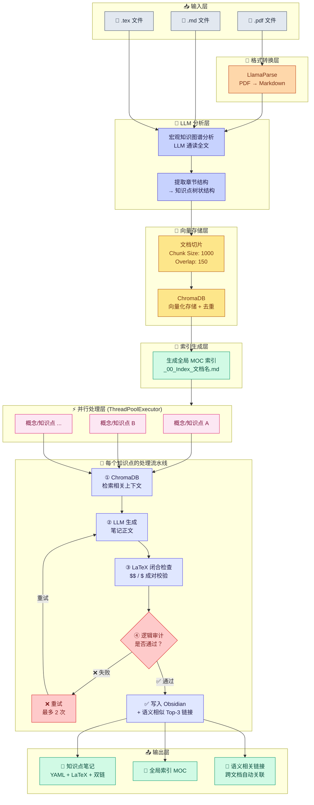

# 工作流流程图生成 Prompt

> 将以下内容复制到 AI 对话中（如 Claude、ChatGPT、Mermaid Live Editor 等），即可生成 Lecture2Obsidian 流水线的可视化流程图。

---

## 方案一：Mermaid 流程图（推荐）

将下面的 Mermaid 代码复制到 [Mermaid Live Editor](https://mermaid.live) 或支持 Mermaid 的 Markdown 编辑器中查看：



---

## 方案二：供 AI 生成图表的 Prompt（纯文本描述）

如果你想把这段描述喂给 AI 让它帮你生成图表，用这段：

```
请根据以下描述生成 Lecture2Obsidian 项目的流水线流程图。这是一个将数学讲义自动转化为 Obsidian 知识库的系统。

## 流程步骤

### 1. 输入层
- 支持三种文件格式：.md、.tex、.pdf
- 文件放入 data/ 目录

### 2. 格式转换层（仅 PDF）
- PDF 文件通过 LlamaParse 转换为 Markdown 格式

### 3. LLM 分析层
- LLM 通读全文，进行宏观知识图谱分析
- 提取章节结构，构建知识点树状结构

### 4. 向量存储层
- 文档切片（Chunk Size 1000, Overlap 150）
- ChromaDB 向量化存储，自动去重

### 5. 索引生成层
- 生成全局 MOC 索引文件 _00_Index_文档名.md

### 6. 并行处理层
- ThreadPoolExecutor 多线程并行，默认 4 线程
- 每个知识点独立处理

### 7. 每个知识点的处理子流程
- ① ChromaDB 检索相关上下文
- ② LLM 生成笔记正文（带 prompt 泄漏防护）
- ③ LaTeX 闭合检查（$$ 和 $ 成对校验）
- ④ 逻辑审计判断
  - 通过 → 写入 Obsidian
  - 失败 → 重试（最多 2 次），回到步骤 ②

### 8. 输出层
- 知识点笔记（YAML frontmatter + LaTeX + 双链）
- 全局索引 MOC
- 语义相关链接（跨文档 Top-3 相似笔记）

## 样式要求
- 使用泳道图（Swimlane）或分层架构图风格
- 不同层级使用不同颜色区分
- 中文标注
- 清晰展示并行处理的分支结构
- 显示重试循环
```

---

## 使用方式

| 工具 | 方法 |
|------|------|
| **Mermaid Live** | 复制方案一的 Mermaid 代码到 [mermaid.live](https://mermaid.live) |
| **Obsidian** | 在笔记中直接粘贴 Mermaid 代码块 ```` ```mermaid ```` |
| **draw.io** | 使用方案二的 Prompt 描述，让 AI 生成 draw.io 格式 |
| **Claude / ChatGPT** | 复制方案二 Prompt，让 AI 生成你想要的图表格式 |

直接打开 [mermaid.live](https://mermaid.live/?code=graph%20TB%0A%20%20%20%20subgraph%20INPUT%5B%22%F0%9F%93%A5%20%E8%BE%93%E5%85%A5%E5%B1%82%22%5D%0A%20%20%20%20%20%20%20%20A1%5B%22%F0%9F%93%84%20.md%20%E6%96%87%E4%BB%B6%22%5D%20%0A%20%20%20%20%20%20%20%20A2%5B%22%F0%9F%93%84%20.tex%20%E6%96%87%E4%BB%B6%22%5D%0A%20%20%20%20%20%20%20%20A3%5B%22%F0%9F%93%84%20.pdf%20%E6%96%87%E4%BB%B6%22%5D%0A%20%20%20%20end%0A%0A%20%20%20%20subgraph%20PARSE%5B%22%F0%9F%94%84%20%E6%A0%BC%E5%BC%8F%E8%BD%AC%E6%8D%A2%E5%B1%82%22%5D%0A%20%20%20%20%20%20%20%20B%5B%22LlamaParse%3Cbr/%3EPDF%20%E2%86%92%20Markdown%22%5D%0A%20%20%20%20end%0A%0A%20%20%20%20subgraph%20ANALYZE%5B%22%F0%9F%A7%A0%20LLM%20%E5%88%86%E6%9E%90%E5%B1%82%22%5D%0A%20%20%20%20%20%20%20%20C%5B%22%E5%AE%8F%E8%A7%82%E7%9F%A5%E8%AF%86%E5%9B%BE%E8%B0%B1%E5%88%86%E6%9E%90%3Cbr/%3ELLM%20%E9%80%9A%E8%AF%BB%E5%85%A8%E6%96%87%22%5D%0A%20%20%20%20%20%20%20%20D%5B%22%E6%8F%90%E5%8F%96%E7%AB%A0%E8%8A%82%E7%BB%93%E6%9E%84%3Cbr/%3E%E2%86%92%20%E7%9F%A5%E8%AF%86%E7%82%B9%E6%A0%91%E7%8A%B6%E7%BB%93%E6%9E%84%22%5D%0A%20%20%20%20end%0A%0A%20%20%20%20subgraph%20STORE%5B%22%F0%9F%92%BE%20%E5%90%91%E9%87%8F%E5%AD%98%E5%82%A8%E5%B1%82%22%5D%0A%20%20%20%20%20%20%20%20E%5B%22%E6%96%87%E6%A1%A3%E5%88%87%E7%89%87%3Cbr/%3EChunk%20Size%3A%201000%3Cbr/%3EOverlap%3A%20150%22%5D%0A%20%20%20%20%20%20%20%20F%5B%22ChromaDB%3Cbr/%3E%E5%90%91%E9%87%8F%E5%8C%96%E5%AD%98%E5%82%A8%20%2B%20%E5%8E%BB%E9%87%8D%22%5D%0A%20%20%20%20end%0A%0A%20%20%20%20subgraph%20INDEX%5B%22%F0%9F%93%91%20%E7%B4%A2%E5%BC%95%E7%94%9F%E6%88%90%E5%B1%82%22%5D%0A%20%20%20%20%20%20%20%20G%5B%22%E7%94%9F%E6%88%90%E5%85%A8%E5%B1%80%20MOC%20%E7%B4%A2%E5%BC%95%3Cbr/%3E_00_Index_%E6%96%87%E6%A1%A3%E5%90%8D.md%22%5D%0A%20%20%20%20end%0A%0A%20%20%20%20subgraph%20PARALLEL%5B%22%E2%9A%A1%20%E5%B9%B6%E8%A1%8C%E5%A4%84%E7%90%86%E5%B1%82%20(ThreadPoolExecutor)%22%5D%0A%20%20%20%20%20%20%20%20direction%20TB%0A%20%20%20%20%20%20%20%20H1%5B%22%E6%A6%82%E5%BF%B5%2F%E7%9F%A5%E8%AF%86%E7%82%B9%20A%22%5D%0A%20%20%20%20%20%20%20%20H2%5B%22%E6%A6%82%E5%BF%B5%2F%E7%9F%A5%E8%AF%86%E7%82%B9%20B%22%5D%0A%20%20%20%20%20%20%20%20H3%5B%22%E6%A6%82%E5%BF%B5%2F%E7%9F%A5%E8%AF%86%E7%82%B9%20...%22%5D%0A%20%20%20%20end%0A%0A%20%20%20%20subgraph%20PER_NODE%5B%22%F0%9F%94%A7%20%E6%AF%8F%E4%B8%AA%E7%9F%A5%E8%AF%86%E7%82%B9%E7%9A%84%E5%A4%84%E7%90%86%E6%B5%81%E7%A8%8B%22%5D%0A%20%20%20%20%20%20%20%20I1%5B%22%E2%91%A0%20ChromaDB%3Cbr/%3E%E6%A3%80%E7%B4%A2%E7%9B%B8%E5%85%B3%E4%B8%8A%E4%B8%8B%E6%96%87%22%5D%0A%20%20%20%20%20%20%20%20I2%5B%22%E2%91%A1%20LLM%20%E7%94%9F%E6%88%90%3Cbr/%3E%E7%AC%94%E8%AE%B0%E6%AD%A3%E6%96%87%22%5D%0A%20%20%20%20%20%20%20%20I3%5B%22%E2%91%A2%20LaTeX%20%E9%97%AD%E5%90%88%E6%A3%80%E6%9F%A5%3Cbr/%3E%24%24%20%2F%20%24%20%E6%88%90%E5%AF%B9%E6%A0%A1%E9%AA%8C%22%5D%0A%20%20%20%20%20%20%20%20I4%7B%22%E2%91%A3%20%E9%80%BB%E8%BE%91%E5%AE%A1%E8%AE%A1%3Cbr/%3E%E6%98%AF%E5%90%A6%E9%80%9A%E8%BF%87%EF%BC%9F%22%7D%0A%20%20%20%20%20%20%20%20I5%5B%22%E2%9D%8C%20%E9%87%8D%E8%AF%95%3Cbr/%3E%E6%9C%80%E5%A4%9A%202%20%E6%AC%A1%22%5D%0A%20%20%20%20%20%20%20%20I6%5B%22%E2%9C%85%20%E5%86%99%E5%85%A5%20Obsidian%3Cbr/%3E%2B%20%E8%AF%AD%E4%B9%89%E7%9B%B8%E4%BC%BC%20Top-3%20%E9%93%BE%E6%8E%A5%22%5D%0A%20%20%20%20end%0A%0A%20%20%20%20subgraph%20OUTPUT%5B%22%F0%9F%93%A4%20%E8%BE%93%E5%87%BA%E5%B1%82%22%5D%0A%20%20%20%20%20%20%20%20J1%5B%22%F0%9F%93%9D%20%E7%9F%A5%E8%AF%86%E7%82%B9%E7%AC%94%E8%AE%B0%3Cbr/%3EYAML%20%2B%20LaTeX%20%2B%20%E5%8F%8C%E9%93%BE%22%5D%0A%20%20%20%20%20%20%20%20J2%5B%22%F0%9F%93%91%20%E5%85%A8%E5%B1%80%E7%B4%A2%E5%BC%95%20MOC%22%5D%0A%20%20%20%20%20%20%20%20J3%5B%22%F0%9F%94%97%20%E8%AF%AD%E4%B9%89%E7%9B%B8%E5%85%B3%E9%93%BE%E6%8E%A5%3Cbr/%E3%80%8F%E8%B7%A8%E6%96%87%E6%A1%A3%E8%87%AA%E5%8A%A8%E5%85%B3%E8%81%94%22%5D%0A%20%20%20%20end%0A%0A%20%20%20%20A3%20--%3E%20B%0A%20%20%20%20B%20--%3E%20C%0A%20%20%20%20A1%20--%3E%20C%0A%20%20%20%20A2%20--%3E%20C%0A%20%20%20%20C%20--%3E%20D%0A%20%20%20%20D%20--%3E%20E%0A%20%20%20%20E%20--%3E%20F%0A%20%20%20%20F%20--%3E%20G%0A%20%20%20%20G%20--%3E%20PARALLEL%0A%20%20%20%20H1%20--%3E%20I1%0A%20%20%20%20H2%20--%3E%20I1%0A%20%20%20%20H3%20--%3E%20I1%0A%20%20%20%20I1%20--%3E%20I2%0A%20%20%20%20I2%20--%3E%20I3%0A%20%20%20%20I3%20--%3E%20I4%0A%20%20%20%20I4%20--%20%22%E2%9D%8C%20%E5%A4%B1%E8%B4%A5%22%20--%3E%20I5%0A%20%20%20%20I5%20--%20%22%E9%87%8D%E8%AF%95%22%20--%3E%20I2%0A%20%20%20%20I4%20--%20%22%E2%9C%85%20%E9%80%9A%E8%BF%87%22%20--%3E%20I6%0A%20%20%20%20I6%20--%3E%20J1%0A%20%20%20%20I6%20--%3E%20J2%0A%20%20%20%20I6%20--%3E%20J3) 即可直接查看效果。
